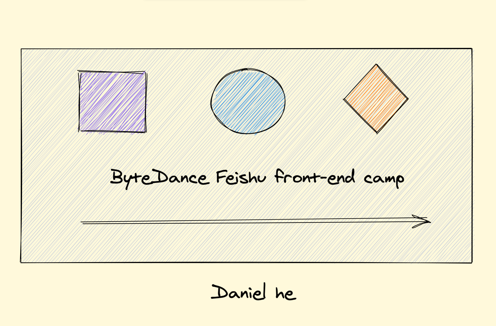

<div align="center" style="display:flex;flex-direction:column;">
  
  <h3>校园训练营“互动协同图表实战”</h3>
</div>

# NOTE

代码库包含两部分：

* 互动协同图表应用: 基于excalidraw的音视频图表应用
* code-examples：包括两个简化的代码示例(图表和webRTC)，方便大家上手学习

## 互动协同图表应用

### 开发项目

#### client

```sh
yarn #安装依赖
yarn start # start on port 3002
```

#### server

```sh
yarn #安装依赖
yarn build && yarn start #启动服务
```

会监听两个端口 3000 和3001，分别是白板消息和WebRTC信令

### 部署

支持Docker, 具体部署步骤参考第三讲

#### NOTE

上线是需要改下.env下对应的服务端配置，REACT_APP_SOCKET_SERVER_URL是白板消息服务，REACT_APP_PEER_SERVER_URL是WebRTC信令服务

```sh
REACT_APP_SOCKET_SERVER_URL=http://localhost:3000/
REACT_APP_PEER_SERVER_URL=http://localhost:3001/
```

## code-example 项目

包含两个示例

### simple-drawing（图表编辑）

```sh
1. 安装serve
npm i -g serve
或
yarn global add serve

2. 直接在目录下运行serve(默认5000端口)
```

### webRTC (实时音视频通信)

```sh
#client
yarn #安装依赖
yarn start

#server
yarn #安装依赖
yarn start
```
